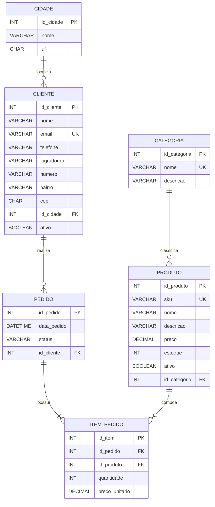

# Modelo Lógico - Loja Online

Diagrama lógico da Sprint 3, derivado do modelo conceitual da Sprint 2 e normalizado até a Terceira Forma Normal (3FN).

## Chaves e relacionamentos

- `categoria.id_categoria` é referenciada por `produto.id_categoria`.
- `cidade.id_cidade` é referenciada por `cliente.id_cidade`.
- `cliente.id_cliente` é referenciada por `pedido.id_cliente`.
- `pedido.id_pedido` é referenciada por `item_pedido.id_pedido`.
- `produto.id_produto` é referenciada por `item_pedido.id_produto`.
- A combinação de pedido e produto é única em `item_pedido`.

## Cardinalidades

- Uma categoria pode classificar zero ou muitos produtos; cada produto possui uma categoria.
- Uma cidade pode possuir zero ou muitos clientes; cada cliente pertence a uma cidade.
- Um cliente pode realizar zero ou muitos pedidos; cada pedido pertence a um cliente.
- Um pedido possui um ou muitos itens; cada item pertence a um pedido.
- Um produto pode aparecer em zero ou muitos itens; cada item referencia um produto.

## Regras de integridade

- E-mail do cliente, SKU do produto e nome da categoria são únicos.
- A combinação de nome e UF identifica uma cidade sem repetição.
- A combinação de pedido e produto não se repete em `item_pedido`.
- Preço e estoque não podem ser negativos.
- Quantidade deve ser maior que zero.
- CEP deve conter oito dígitos.
- Status do pedido aceita apenas valores definidos no script SQL.
